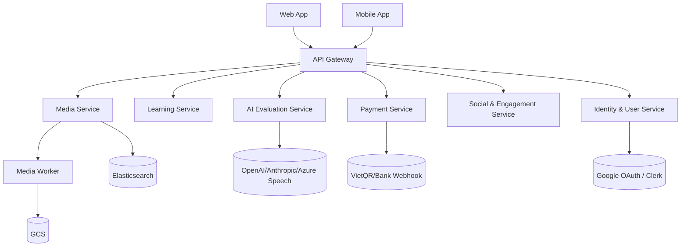
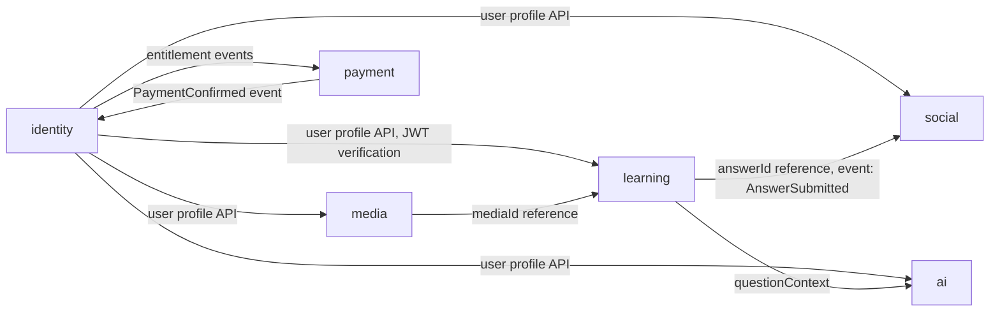
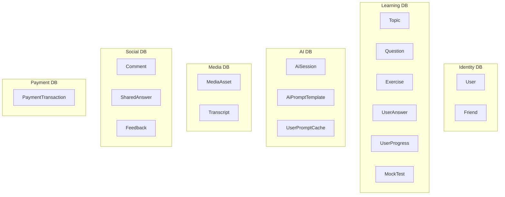
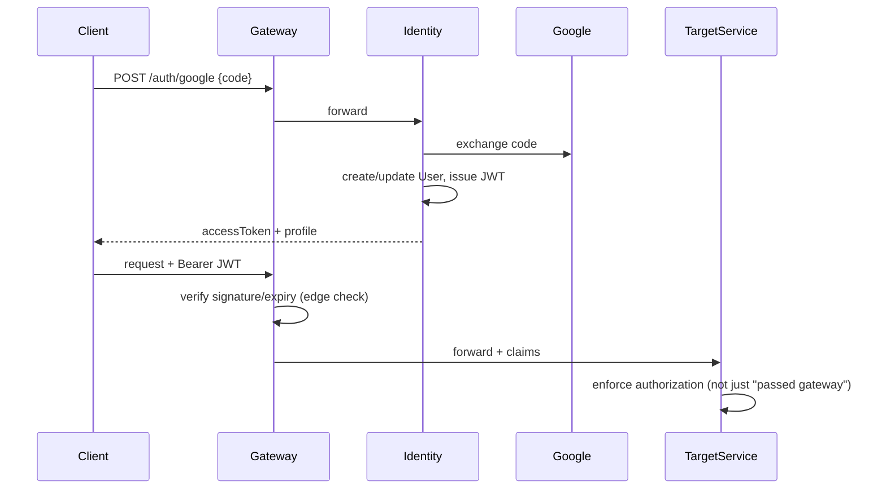
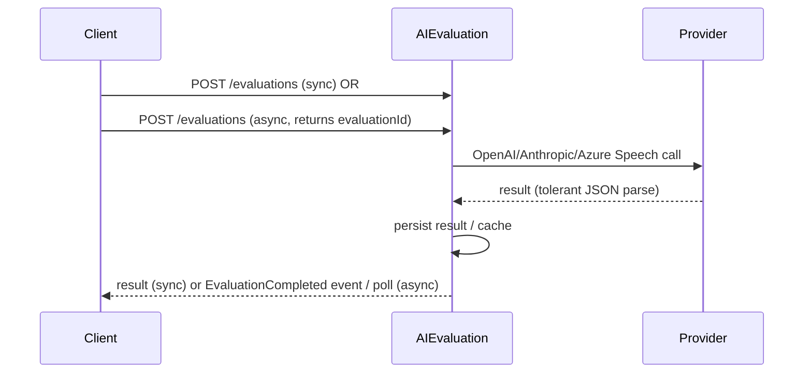
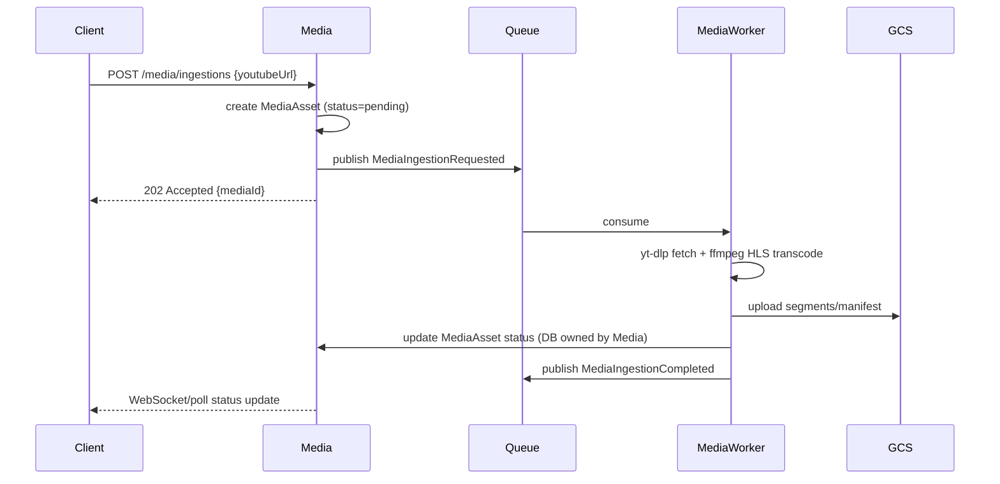
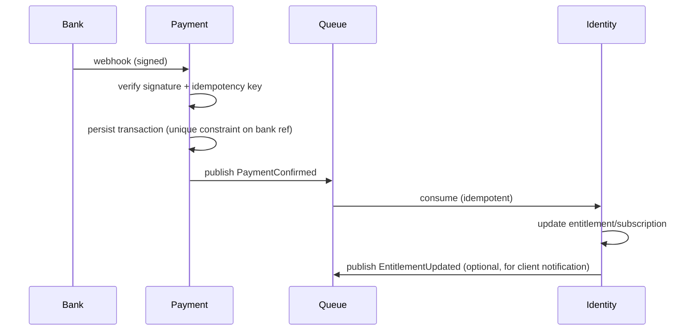
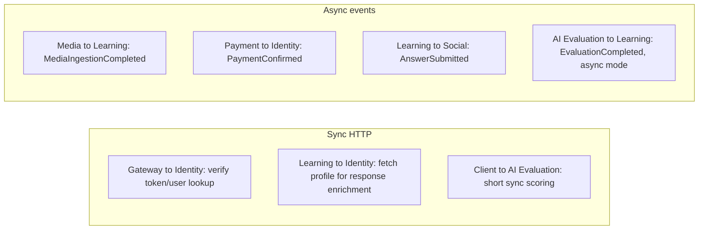

# 02 — Target Microservices Architecture

This adapts and validates the candidate design already proposed in the source assessment
(`docs/architecture-assessment/08-microservices-architecture-design.md`, read as prior art) against
the target project's real stack (see `01-current-state-assessment.md`). Candidate services are
**not mandatory deployment units** — consolidate/split as evidence dictates.

## 1. Candidate services

| Service                  | Source modules absorbed                                                                                                                                                                                                                                | Responsibility                                                                                                                                |
| ------------------------ | ------------------------------------------------------------------------------------------------------------------------------------------------------------------------------------------------------------------------------------------------------ | --------------------------------------------------------------------------------------------------------------------------------------------- |
| **Identity & User**      | `auth`, `users`                                                                                                                                                                                                                                        | AuthN (Google OAuth, optionally Clerk), JWT issuance, profile, subscription/entitlement flags, authorization policy                           |
| **Learning**             | `topics`, `questions`, `exercises`, `vocabulary`, `sample-sentence`, `dictionary`, `suggestions`, `ai-sessions`, `ai-session-question`, `mock-test`, `user-answers`, `user-progress`, `user-question-interaction`, `user-vocabulary`, `learning` (SRS) | Curriculum content, practice sessions, answers, progress, spaced repetition                                                                   |
| **AI Evaluation**        | `ielts-evaluation`, `speaking-analysis`, `ai-prompt-templates`, `user-prompt-cache`                                                                                                                                                                    | Grammar/vocab/coherence/pronunciation scoring, multi-provider orchestration (OpenAI/Anthropic/Azure Speech), prompt templates                 |
| **Media + Media Worker** | `media`, `transcript`, `search`                                                                                                                                                                                                                        | YouTube ingestion, FFmpeg/yt-dlp HLS transcoding (worker), engagement tracking, transcript, Elasticsearch-backed search                       |
| **Social & Engagement**  | `comment`, `shared-answers`, `feedbacks`, notification part of `web_socket`                                                                                                                                                                            | Comments, shared answers, feedback, realtime notification                                                                                     |
| **Payment**              | `vqr`                                                                                                                                                                                                                                                  | QR payment generation, bank webhook confirmation, reconciliation — **security-critical, verify webhook signature validation before any port** |
| **API Gateway**          | n/a (new)                                                                                                                                                                                                                                              | Single entry point, JWT edge validation, routing, rate limiting, WebSocket passthrough                                                        |
| Platform/cross-cutting   | `events`, remaining `web_socket`, `share`, `posthog`, `health`                                                                                                                                                                                         | Not necessarily a deployable service; may remain library code or a small ops service                                                          |

## 2. Why these boundaries

- **Identity** is split out because `UserService` is a shared kernel today (confirmed dependency
  from nearly every module) — isolating it first, behind an API/contract, is the precondition for
  every other service to stop doing direct DB joins against `User`.
- **Media** is isolated primarily for _runtime characteristics_, not just business capability: it
  is the only workload with long-running native-process execution (ffmpeg/yt-dlp) that does not fit
  a request/response Cloud Run-style lifecycle — confirmed risk in source `07-technical-debt.md`
  ("Deployment & Operational Risk Notes"). The **Media Worker** must be independently deployable and
  scalable from the Media API for this reason alone.
- **AI Evaluation** is isolated because of distinct non-functional needs: external provider
  timeouts/cost/quota control, tolerant JSON parsing, and retry policies that must not block or be
  coupled to Learning CRUD latency.
- **Learning** stays a single, relatively large bounded context (not split per CRUD module) because
  entities like `Question`, `Exercise`, `UserAnswer`, `MockTest`, `UserProgress` are transactionally
  related within one user-facing workflow (submitting an answer updates progress); splitting further
  would force distributed transactions for no proven scaling benefit.
- **Social** stays decoupled from Learning: it references `answerId`/`questionId` by ID, not by
  owning the record, avoiding a shared-write table.
- **Payment** is isolated for blast-radius and compliance reasons (financial data, webhook trust
  boundary) even though it has no confirmed dependency on any learning entity today.
- **API Gateway** is justified because there are two real client types (web + mobile) that need one
  stable entry point, JWT edge-checks, and WebSocket routing — not because "microservices need a
  gateway" by default.

## 3. Diagrams

### 3.1 System context / container view

### 3.2 Service boundaries and dependencies

### 3.3 Database ownership

All on one PostgreSQL cluster initially (separate schemas/users per service), not separate physical
servers — see `04-database-and-event-strategy.md`.

### 3.4 Authentication flow

### 3.5 AI evaluation flow (sync and async modes)

### 3.6 Media ingestion and HLS processing

### 3.7 Payment confirmation and subscription update

### 3.8 Synchronous vs. asynchronous communication

## 4. Open questions carried into `03-service-boundaries-and-ownership.md`

- Whether Clerk is retained or consolidated into a single Spring Security/OAuth2 resource-server
  flow — **UNKNOWN**, product decision required.
- Whether comments are written via REST, WebSocket, or both in the source — **UNKNOWN**
  (source `05-runtime-flows.md` Flow 5), must be resolved before designing the Social service write
  path, to avoid silently dropping or duplicating functionality.
